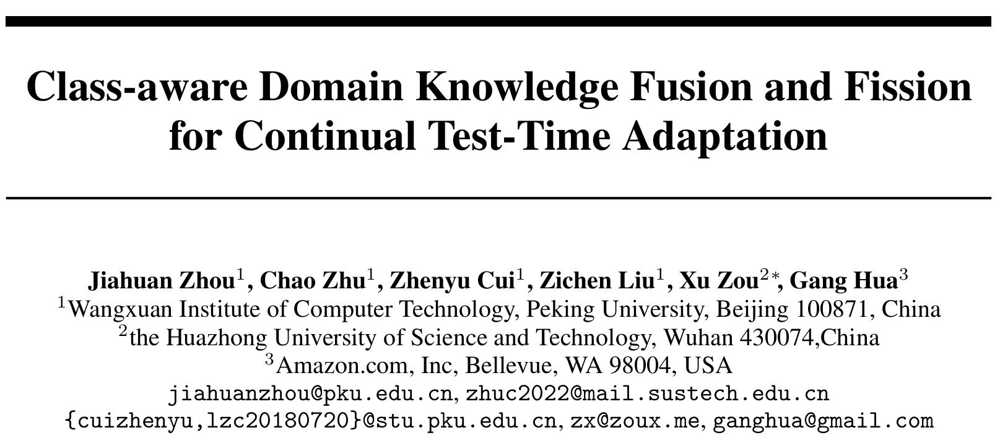
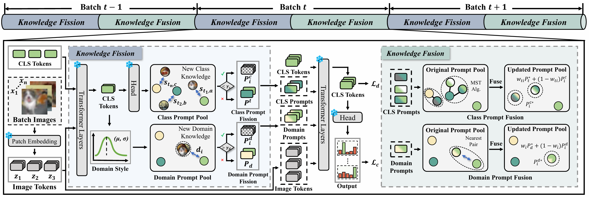
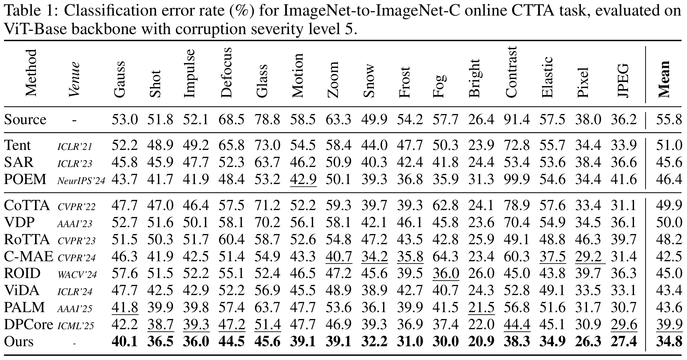

<!-- <div align="center">

</div> -->

# [NeurIPS 2025] Class-aware Domain Knowledge Fusion and Fission for Continual Test-Time Adaptation

<div align="center">

<div>
      Jiahuan Zhou<sup>1</sup>&emsp; Chao Zhu<sup>1</sup>&emsp;  Zhenyu Cui<sup>1</sup>&emsp; Zichen Liu<sup>1</sup>&emsp; Xu Zou<sup>2*</sup>&emsp; Gang Hua<sup>3</sup>
  </div>
<div>

  <sup>1</sup>Wangxuan Institute of Computer Technology, Peking University&emsp;
    <sup>2</sup>School of Artificial Intelligence and Automation, Huazhong University of Science and Technology&emsp;
    <sup>3</sup>Amazon Inc.&emsp;

</div>
</div>

<p align="center">
<a href='https://arxiv.org/pdf/????.????'></a>
  <a href="https://github.com/zhoujiahuan1991/NeurIPS2025-KFF"></a>
</p>

This is the *official* repository for [Class-aware Domain Knowledge Fusion and Fission for Continual Test-Time Adaptation](paper).

<div align="center">

</div>

## Experiments

### Environment Preparation
```bash
conda create -n CTTA python==3.9.7
conda activate CTTA
pip install torch==2.1.1 torchvision==0.16.1 torchaudio==2.1.1 --index-url https://download.pytorch.org/whl/cu121
pip install -r requirements.txt
```

### Data Preparation

+ ImageNet-C [Download](https://zenodo.org/record/2235448#.Yj2RO_co_mF)
+ Other datasets can be downloaded automatically.

Set `--data_dir` to your corruption dataset path.

For the "Source Domain Statistics", besides training it by yourself, you can also use the one provided by us:
[ImageNet](https://drive.google.com/file/d/1KLkKDY4Hs9b9ABbudlGvhM-Sj3_L1AMM/view?usp=sharing), 
[Cifar10](https://drive.google.com/file/d/1KLkKDY4Hs9b9ABbudlGvhM-Sj3_L1AMM/view?usp=sharing), 
[Cifar100](https://drive.google.com/file/d/1p1NoCI6UA6KuGcq_YdARH3kS9SHPv16c/view?usp=drive_link).

You can set `--train_info` to use the provided "Source Domain Statistics", or you can train it yourself by setting `--src_data_dir`.

### Source Model Preparation

+ ImageNet-to-ImageNet-C: you can directly load it from timm.
+ Cifar10-to-Cifar10-C: you can load the source model from [here](https://drive.google.com/file/d/1pAoz4Wwos74DjWPQ5d-6ntyjQkmp9FPE/view?usp=sharing).
+ Cifar100-to-Cifar100-C: you can load the source model from [here](https://drive.google.com/file/d/1yRekkpkIdwX_LFsOh4Ba9ndaECnY-UC-/view?usp=sharing).

For Cifar10-to-Cifar10-C/Cifar100-to-Cifar100-C, load the source model by setting `--checkpoint`.


### Training and Evaluation
```bash
bash bash/imagenet.sh
bash bash/cifar10.sh
bash bash/cifar100.sh
```

### Results

The results were obtained with a single NVIDIA 4090 GPU.

<div align="center">

</div>

## Citation
If you find this code useful for your research, please cite our paper.
```bibtex
@inproceedings{zhou2025classaware,
    title={Class-aware Domain Knowledge Fusion and Fission for Continual Test-Time Adaptation}, 
    author={Zhou, Jiahuan and Zhu, Chao and Cui, Zhenyu and Liu, Zichen and Zou, Xu and Hua, Gang}, 
    booktitle={The Thirty-ninth Annual Conference on Neural Information Processing Systems}, 
    year={2025} 
}
```

## Acknowledgements
Our code is based on the PyTorch implementation of the following projects:
- [CoTTA](https://github.com/qinenergy/cotta) 
- [ViDA](https://github.com/Yangsenqiao/vida) 
- [DPCore](https://github.com/yunbeizhang/DPCore) 
- [Robustbench](https://github.com/RobustBench/robustbench)